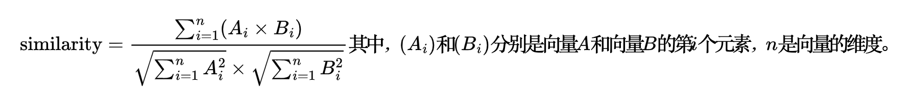

余弦相似度是一种衡量两个向量之间相似度的方法，常用于文本相似度计算、推荐系统和数据挖掘等领域。它衡量的是两个向量在多维空间中的夹角的余弦值，值越接近1表示越相似，值越接近-1表示越不相似，而值为0表示两个向量之间完全不相关。

在文本相似度计算中，通常将文本表示为向量，例如使用词袋模型。然后，通过计算两个文本向量之间的余弦相似度来衡量它们之间的相似程度。具体而言，余弦相似度计算公式如下：

余弦相似度的优点之一是不受向量的绝对大小影响，只受向量之间的夹角影响，因此对文本长度不敏感。这使得余弦相似度在处理不同长度的文本时表现良好。